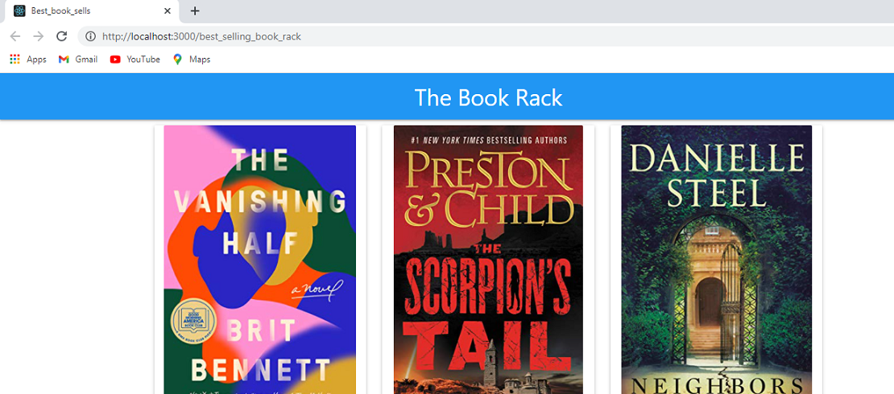
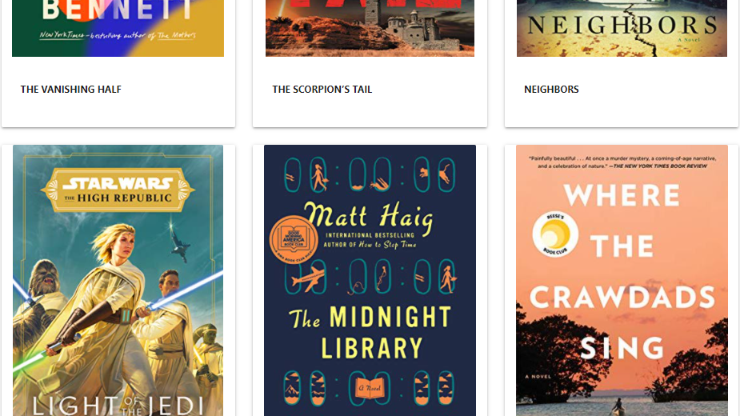
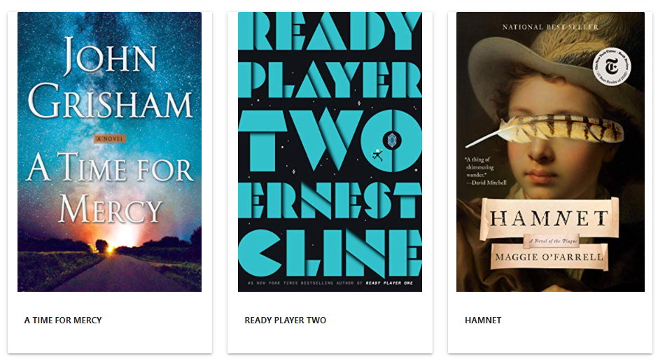
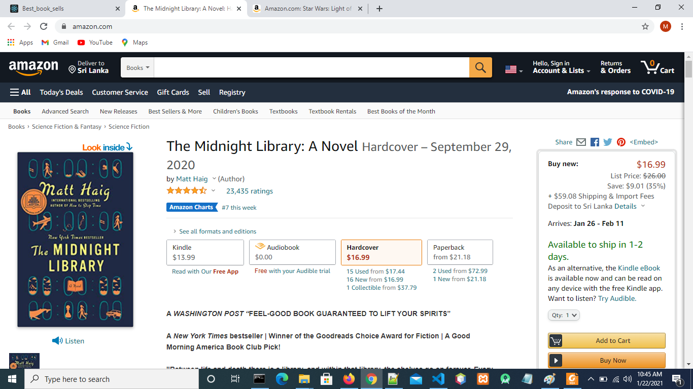
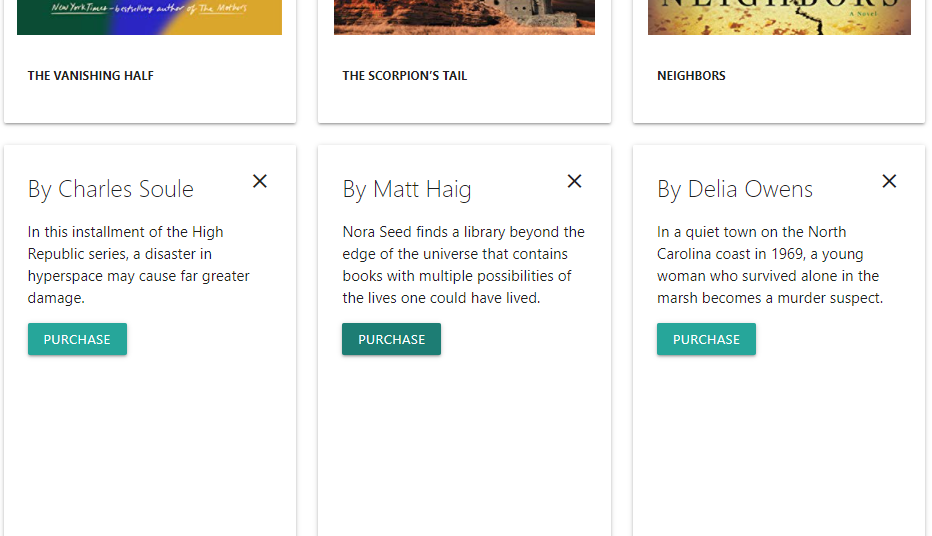

# How to run the best_selling_book_rack application
1. Clone the repositry
2. Navigate to the project folder path
3. For the install the depedendies use command: npm install
4. For starting the server use command: npm start 

# Screenshots of the best_selling_book_rack application

    

    

    

    

    

    

